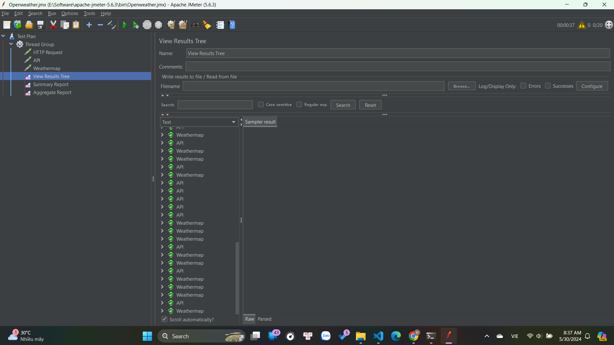
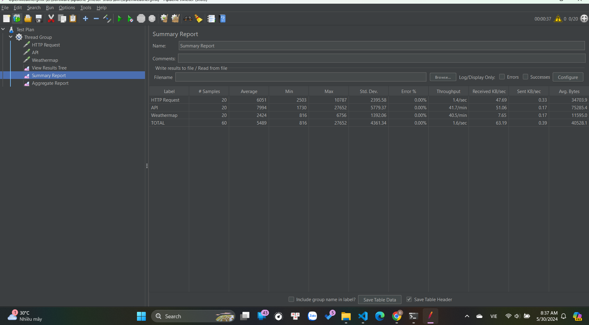

# JMeter

Ngày 30/5/2024

Báo cáo dựa vào file excel trong tệp

Phần I:

1. Tổng quan về các yêu cầu:

- Tổng số yêu cầu: 15

- Số lượng yêu cầu thành công: 13

- Số lượng yêu cầu thất bại: 2

- Tỷ lệ lỗi: 13.33%

2. Thời gian phản hồi:

- Thời gian phản hồi trung bình: 4920.87 ms

- Thời gian phản hồi nhỏ nhất: 8 ms

- Thời gian phản hồi lớn nhất: 22887 ms

- Thời gian phản hồi của 90% yêu cầu (90th Percentile): 18994.8 ms

3. Throughput:

- Throughput (số lượng yêu cầu/giây): 0.246 yêu cầu/giây

Kết luận về hiệu năng của trang web

1. Thời gian phản hồi:

   - Thời gian phản hồi trung bình là 4920.87 ms, cho thấy có một số yêu cầu có thời gian phản hồi rất lâu.

   - Thời gian phản hồi của 90% yêu cầu (90th Percentile) là 18994.8 ms, nghĩa là 10% yêu cầu có thời gian phản hồi rất cao.

2. Tỷ lệ lỗi

   - Tỷ lệ lỗi là 13.33%, đây là một tỷ lệ khá cao. Điều này có nghĩa là hơn 13% yêu cầu không thành công, cần kiểm tra và cải thiện.

3. Throughput:

   - Throughput là 0.246 yêu cầu/giây, cho thấy trang web có khả năng xử lý một số lượng yêu cầu khá thấp trong một khoảng thời gian.

Phần II:

Phân tích kết quả kiểm tra API

1. Tổng quan về các yêu cầu:

- Tổng số yêu cầu: 9

- Số lượng yêu cầu thành công: 9

- Số lượng yêu cầu thất bại: 0

- Tỷ lệ lỗi: 0

2. Thời gian phản hồi:

- Thời gian phản hồi trung bình: 1125,67 ms

- Thời gian phản hồi nhỏ nhất: 336 ms

- Thời gian phản hồi lớn nhất: 1488 ms

- Thời gian phản hồi của 90% yêu cầu (90th Percentile): 625,78 ms

3. Throughput:

- Throughput (số lượng yêu cầu/giây): 2 yêu cầu/giây

1. Thời gian phản hồi:

   - Thời gian phản hồi trung bình là 1125,67 ms, cho thấy có một số yêu cầu có thời gian phản hồi chậm.

   - Thời gian phản hồi của 90% yêu cầu (90th Percentile) là 18994.8 ms, nghĩa là 10% yêu cầu có thời gian phản hồi tốt.

2. Tỷ lệ lỗi

   - Tỷ lệ lỗi là 0%

3. Throughput:

   - Throughput là 2 yêu cầu/giây, cho thấy trang web có khả năng xử lý một số lượng yêu cầu khá thấp trong một khoảng thời gian.
